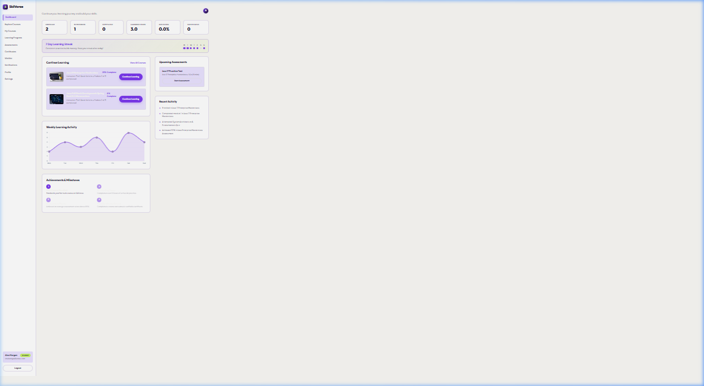

# SkilVorae — Online Learning & Career Skills Platform

> Enterprise-grade Learning Management System (LMS) built with **Java 17 / Spring Boot 3**, **MySQL Database**, **Spring Security 6**, **Spring Data JPA**, **Thymeleaf**, and **Vanilla CSS**.

---

## Database Architecture: MySQL

The application connects to **MySQL Database** as its primary persistence engine:

- **Database Name**: `skilvoraedb`
- **Connection URL**: `jdbc:mysql://localhost:3306/skilvoraedb?createDatabaseIfNotExist=true&useSSL=false`
- **Driver**: `com.mysql.cj.jdbc.Driver`
- **Dialect**: `org.hibernate.dialect.MySQLDialect`
- **ORM & DDL**: Spring Data JPA / Hibernate (`ddl-auto=update`)
- **Seeder**: Automatically seeds 40+ courses, modules, lessons, quizzes, demo users, enrollments, and reviews on startup via `DataInitializer.java`.

---

## Pre-Configured Demo Login Accounts

Test credentials for all 3 user roles implemented in Spring Security:

| Role | Email | Password | Implemented Features & Access |
| :--- | :--- | :--- | :--- |
| **Student** | `student@skilvorae.com` | `password123` | Enrolled Courses, Curriculum Player, Timed Quizzes, Digital Certificates, Wishlist, Dashboard |
| **Instructor** | `instructor@skilvorae.com` | `password123` | Authoring Dashboard, 4-Step Course Creation Wizard, Roster Management, CSV Data Export |
| **Admin** | `admin@skilvorae.com` | `password123` | Platform Metrics, User Role Controls, Certificate Authenticity Verifier, Audit Logs Export |

---

## Application Screenshot & Demo Assets



### Asset References:
- **Dashboard Preview**: [`assets/image.png`](assets/image.png)
- **Navigation Recording**: [`assets/navigation.webp`](assets/navigation.webp)

---

## Implemented Features List

### 1. Landing Page & Course Catalog
- **3-Cards-per-Row Featured Grid**: Displays 6 top-rated courses formatted in a 3-column responsive grid (`display: grid; grid-template-columns: repeat(3, 1fr)`).
- **Course Catalog (`/courses`)**: Dynamic search bar (title/instructor), category dropdown filter, difficulty filter, min rating filter, price sorting, and paginated navigation.
- **Interactive Checkout Modal**: Order summary modal with price breakdown and 18% GST calculation.

### 2. Student Learning & Assessment Engine
- **Curriculum Lesson Player (`/courses/{id}/learn`)**: Video lesson viewer with module sidebar, lesson switching, and real-time "Mark as Complete" progress updates.
- **Timed Quiz Engine (`/assessments/{id}`)**: Automated countdown timer, question navigator grid, option selection, and score reports (`/assessments/result/{id}`).
- **Digital Certificates (`/certificates/{id}`)**: Printable completion certificates with unique serial numbers.
- **Course Wishlist API (`/api/wishlist`)**: Bookmark and un-bookmark courses to user wishlist.
- **Recommendation Engine (`/api/recommendations`)**: Category and rating-based related course suggestions.

### 3. Instructor Portal
- **Instructor Dashboard (`/instructor/dashboard`)**: Stat cards for active learners, completion rates, rating averages, and demo earnings.
- **4-Step Course Creation Wizard (`/instructor/dashboard?create=true`)**: Author courses with title, category, difficulty, pricing, modules, and lessons.
- **Roster & CSV Export (`/api/exports/instructor/enrollments`)**: Downloadable CSV report of student rosters and completion statuses.

### 4. Admin Governance & Security
- **Admin Dashboard (`/admin/dashboard`)**: Revenue analytics, user growth visualizer, category distribution charts, and user list.
- **User Permissions Controls**: Manage account status and role permissions.
- **Certificate Verification Tool**: Verify certificate authenticity by serial code against database registry.
- **System Audit Logs & CSV Export (`/api/exports/admin/audit-logs`)**: Real-time audit activity log viewer and CSV export.

---

## Technology Stack

- **Backend**: Java 17 / 21, Spring Boot 3.2.4
- **Database**: MySQL 8.x (`mysql-connector-j`), Spring Data JPA, Hibernate
- **Security**: Spring Security 6, JWT Cookie Sync (`SKILVORAE_JWT`), BCrypt
- **Templating & UI**: Thymeleaf Engine, Vanilla CSS Design System, JavaScript (ES6+)
- **Charts**: Chart.js 4.4.1
- **Build Tool**: Maven 3.9+

---

## Local Execution Instructions

### Prerequisites
1. Installed **Java 17** or **Java 21**
2. Running **MySQL** server on port `3306` with database `skilvoraedb` (or update credentials in `application.properties`)

### Commands

```bash
# 1. Clone repository
git clone https://github.com/Madhusmita-16/skilVorae.git
cd skilVorae

# 2. Run Spring Boot application
mvn spring-boot:run
```

Access the application in your browser at:
```
http://localhost:8080
```

---

## License

MIT License.
