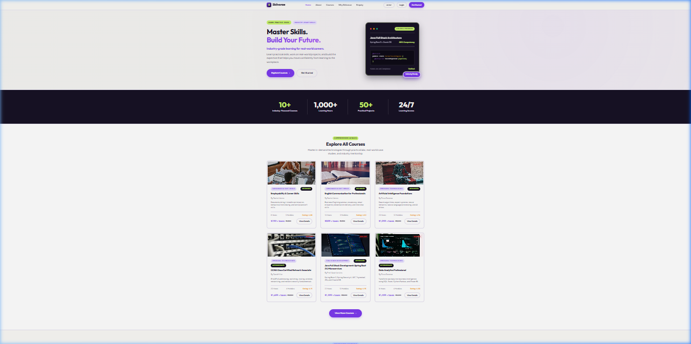

# SkilVorae — Online Learning & Career Skills Platform

> Enterprise-grade Learning Management System (LMS) built with **Java 17 / Spring Boot 3**, **Spring Security 6 (JWT)**, **Spring Data JPA / Hibernate**, **MySQL (production) / H2 (dev)**, **Thymeleaf**, and **Vanilla CSS**.

---

## Demo Login Accounts

| Role | Email | Password |
| :--- | :--- | :--- |
| 🎓 **Student** | `student@skilvorae.com` | `password123` |
| 🧑‍🏫 **Instructor** | `instructor@skilvorae.com` | `password123` |
| 🛡️ **Admin** | `admin@skilvorae.com` | `password123` |

---

## Navigation Demo

> Click the preview below to download and watch the full navigation clip.

[](assets/navigation.webp)

---

## Implemented Features

### Student
- **Landing Page**: 3-cards-per-row featured course grid, search, category filters, pagination
- **Course Catalog (`/courses`)**: Keyword search, category / difficulty / rating filters, price sort
- **Enrollment & Course Player (`/courses/{id}/learn`)**: Video lesson viewer, module sidebar, "Mark as Complete" progress tracking
- **Timed Quiz Engine (`/assessments/{id}`)**: Auto countdown timer, question navigator grid, score reports
- **Digital Certificates (`/certificates/{id}`)**: Printable certificates with unique serial codes
- **Course Wishlist API (`/api/wishlist`)**: Bookmark and un-bookmark courses
- **Recommendation Engine (`/api/recommendations`)**: Category-based course suggestions

### Instructor
- **Instructor Dashboard (`/instructor/dashboard`)**: Active learners, completion rates, rating averages, earnings stats
- **4-Step Course Creation Wizard**: Title, category, difficulty, pricing, modules, and lessons
- **Student Roster & CSV Export (`/api/exports/instructor/enrollments`)**: Download roster CSV

### Admin
- **Admin Dashboard (`/admin/dashboard`)**: Revenue analytics, user growth chart, category distribution, user list
- **User Role Controls**: Manage account status and permissions
- **Certificate Verification Tool**: Verify certificate authenticity by serial code
- **Audit Logs & CSV Export (`/api/exports/admin/audit-logs`)**: Audit log viewer and CSV export

---

## Technology Stack

| Layer | Technology |
| :--- | :--- |
| Backend | Java 17, Spring Boot 3.2.4 |
| Database (Dev) | H2 In-Memory (MySQL compatibility mode) |
| Database (Prod) | MySQL 8.x, Spring Data JPA, Hibernate |
| Security | Spring Security 6, JWT Cookie (`SKILVORAE_JWT`), BCrypt |
| UI | Thymeleaf, Vanilla CSS, JavaScript ES6+ |
| Charts | Chart.js 4.4.1 |
| Build | Apache Maven 3.9+ |

---

## Local Setup

### Prerequisites
- Java 17+ installed

### Run (Zero-Setup — uses H2 in-memory database)

```bash
git clone https://github.com/Madhusmita-16/skilVorae.git
cd skilVorae
mvn spring-boot:run
```

Open in browser: `http://localhost:8080`

### Switch to MySQL (Production)

Edit `src/main/resources/application.properties`, uncomment the MySQL block and comment out the H2 block:

```properties
spring.datasource.url=jdbc:mysql://localhost:3306/skilvoraedb?createDatabaseIfNotExist=true&useSSL=false&allowPublicKeyRetrieval=true&serverTimezone=UTC
spring.datasource.driver-class-name=com.mysql.cj.jdbc.Driver
spring.datasource.username=root
spring.datasource.password=root
spring.jpa.database-platform=org.hibernate.dialect.MySQLDialect
```

---

## License

MIT License
