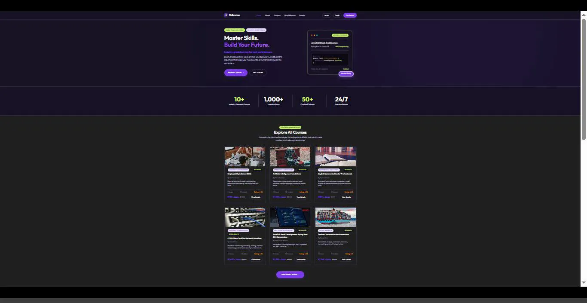

# SkilVorae — Learning Management System

A full-stack LMS built with Spring Boot 3, MySQL, and Thymeleaf. Three separate portals for students, instructors, and admins. No frontend frameworks — just server-side rendering with a custom CSS design system.

---

## Demo



> **Walkthrough covers:** landing page → student dashboard → course catalog → instructor course builder → admin panel.

---

## Try it out

| Role | Email | Password |
| --- | --- | --- |
| Student | `student@skilvorae.com` | `password123` |
| Instructor | `instructor@skilvorae.com` | `password123` |
| Admin | `admin@skilvorae.com` | `password123` |

On first run the app seeds 40+ courses, demo users, and sample enrollments automatically — nothing to configure.

---

## What's inside

**Student side**
- Course catalog with search, category, difficulty, and price filters
- Video lesson player with module/lesson sidebar
- Per-lesson progress tracking ("Mark as Complete")
- Timed quiz engine with question navigator and score report
- Downloadable certificates with unique serial codes
- Course wishlist
- Dashboard showing real stats only — new users see zeros, not fake numbers

**Instructor side**
- Course builder with tabs for details, modules/lessons, assignments, and final assessment
- Upload video, PDF, PPT, or book references per lesson individually
- Inline edit/delete for every module and lesson
- Create quizzes manually or by uploading a structured PDF
- Student roster with CSV export

**Admin side**
- Platform stats: users, courses, enrollments, certificates, revenue
- Full user list with roles and enrollment counts (live data, no placeholders)
- Audit log for the last 20 system actions
- Course catalog view across all instructors

---

## Stack

| | |
| --- | --- |
| Backend | Java 17, Spring Boot 3.2.4 |
| Database | MySQL 8.x + Spring Data JPA (Hibernate, `ddl-auto=update`) |
| Security | Spring Security 6, JWT via HttpOnly cookie, BCrypt |
| Templates | Thymeleaf 3 |
| Frontend | Vanilla CSS + JavaScript ES6+ |
| Charts | Chart.js |
| Build | Maven 3.9 (bundled in the repo under `maven/`) |
| Deploy | Docker / Docker Compose, Render.yaml |

---

## Running locally

You need Java 17+ and MySQL 8 on port 3306.

```bash
git clone https://github.com/Madhusmita-16/skilVorae.git
cd skilVorae
```

Create the database:
```sql
CREATE DATABASE skilvoraedb;
```

Update your credentials in `src/main/resources/application.properties`:
```properties
spring.datasource.username=root
spring.datasource.password=your_password
```

Start the app:
```bash
# bundled Maven — no install needed
./maven/apache-maven-3.9.6/bin/mvn spring-boot:run
```

Then open `http://localhost:8080`.

---

## Docker

```bash
docker-compose up --build
```

Starts the Spring Boot app and a MySQL 8.0 container together with a persistent volume.

---

## Deploying to Render.com

1. **Database Setup**: Create a free MySQL database on [Aiven.io](https://aiven.io/) (or another cloud MySQL provider).
2. **Connect to Render**:
   - Create a new **Web Service** or Blueprint on [Render.com](https://render.com/).
   - Select your GitHub repository `Madhusmita-16/skilVorae`.
   - Set the runtime environment to **Docker**.
3. **Environment Variables**: Add the following Environment Variables in your Render Dashboard:
   - `SPRING_DATASOURCE_URL`: `jdbc:mysql://<host>:<port>/<dbname>?sslmode=require`
   - `SPRING_DATASOURCE_USERNAME`: `<your-db-user>`
   - `SPRING_DATASOURCE_PASSWORD`: `<your-db-password>`
   - `SPRING_JPA_HIBERNATE_DDL_AUTO`: `update`
4. **Deploy**: Render will automatically build the Dockerfile and launch your service with health monitoring on `/login`.

---

## Project layout

```
src/main/java/com/skilvorae/
├── controller/       # MVC page controllers + api/ REST controllers
├── service/          # Business logic
├── repository/       # Spring Data repositories
├── entity/           # 23 JPA domain models
├── dto/              # View and API data objects
├── security/         # JWT filter, SecurityConfig
└── util/             # DataInitializer (seed on first boot)

src/main/resources/
├── templates/        # Thymeleaf templates (dashboard, instructor, admin, course, fragments)
├── static/css/       # main.css + dashboard.css
├── static/js/        # chart init, helpers
└── application.properties
```

---

## Notes

- All dashboard data is fetched live from the database. A brand-new account sees `0` everywhere, not placeholder values.
- File uploads (video, PDF, PPT, book, thumbnails) are stored locally under `uploads/` and served as static resources.
- Each role is restricted to its own routes. Instructors can only edit their own courses; admins have full visibility.

---

## License

MIT
